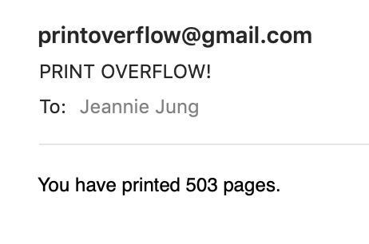

# PrintOverflow

Hackathon project to spread awareness of paper consumption issue on NYUAD campus.

## Conceptual Development
NYUAD is the only NYU campus with free printing for all its community members. Unfortunately, there are no policies that limit our printing currently. That is, everything is free and the resources are there to be utilized. But, we must admit that there is a lot of it being misutilized.

We believe everyone is responsible to be environmentally friendly and sustainable. Hence, we aim to spread awareness of paper consumption issues on campus by trusting the humanity, believing in the conscience of the community members, and providing a good motivation for them.

Relevant article on Gazelle can be found at: https://www.thegazelle.org/issue/165/features/printing-to-cap-or-not-to-cap?fbclid=IwAR0AMHBIJOnxd18Eq6CUnb7J2yNkCkXh28YJttrVmIlB9sI0Pbjd3pMhZjw

## Technical Development
We used NodeJS to create a server for webpage and sending email notifications. Email alerts are sent to the individual on the database when their paper consumption exceeds the pre-set threshold. All members also receive monthly printing activity report with the number of pages printed and their percentile.

Webpage displays more dynamic data. Along with the raw printing activity, we converted this data to the number of trees cut down, the amount of water spent, and the amount of CO2 gas emitted.

For the sake of demonstration, we have created a MySQL query for database. We are anticipating to collaborate with NYUAD and gain access to the NYUAD database to provide this service to all the students and faculty.

## Demonstration Snapshots
This is an example of the email alert for exceeding the threshold.


This is an example of the monthly report everyone receives.


This is a screenshot of raw homepage.


This is a screenshot of raw profile page tailored for each individual.


## How to Run
You need to have following npm packages to run this app:
```
http
url
events
formidable
nodemailer
express
mysql
node-schedule
email-templates@2.x
```

After installing all necessary packages, run:
```
cd Print_Overflow_Final
node app.js
```

## Future Work
User interface will be the first and foremost feature to be improved. We aim to motivate people's conscience and it can only be successfully achieved when proper input has been fed. We define 'proper input' as visually-appealing, attention-provoking, inspirational, and interesting. We plan to add visual dynamics, such as graphs, charts, and images. Monthly reports will also include more dynamic features.

Additional functionalities can be added as well. In order to maximize students' involvement, we are considering adding the 'Hall of Shame', displaying the top three individuals with the largest paper consumptions. We are aware of the potential privacy violation issues that can be raised, and, therefore, it would need further discussion.

We also wish to collaborate with the Ecoherence on discussing further measures to support our goals.
